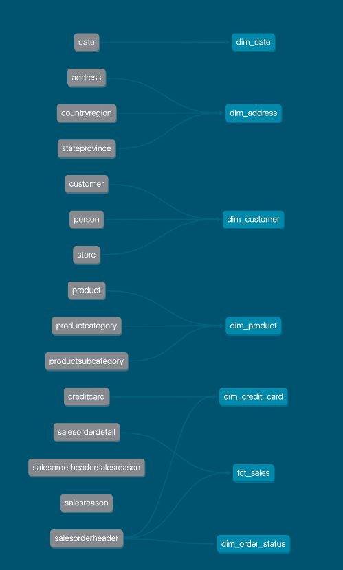

# dbt dimensional modelling tutorial

Welcome to the tutorial on building a Kimball dimensional model with dbt. 

This tutorial is also featured on the [dbt developer blog](https://docs.getdbt.com/blog/kimball-dimensional-model).

## Table of Contents 

- [Part 0: Understand dimensional modelling concepts](#dimensional-modelling)
- [Part 1: Set up a mock dbt project and database](docs/part01-setup-dbt-project.md)
- [Part 2: Identify the business process to model](docs/part02-identify-business-process.md)
- [Part 3: Identify the fact and dimension tables](docs/part03-identify-fact-dimension.md)
- [Part 4: Create the dimension tables](docs/part04-create-dimension.md)
- [Part 5: Create the fact table](docs/part05-create-fact.md)
- [Part 6: Document the dimensional model relationships](docs/part06-document-model.md)
- [Part 7: Consume the dimensional model](docs/part07-consume-model.md)

## Introduction

Dimensional modelling is one of many data modelling techniques that are used by data practitioners to organize and present data for analytics. Other data modelling techniques include Data Vault (DV), Third Normal Form (3NF), and One Big Table (OBT) to name a few.

*Data modelling techniques on a normalization vs denormalization scale*

While the relevancy of dimensional modelling [has been debated by data practitioners](https://discourse.getdbt.com/t/is-kimball-dimensional-modeling-still-relevant-in-a-modern-data-warehouse/225/6), it is still one of the most widely adopted data modelling technique for analytics. 

Despite its popularity, resources on how to create dimensional models using dbt remain scarce and lack detail. This tutorial aims to solve this by providing the definitive guide to dimensional modelling with dbt. 

## Dimensional modelling

Dimensional modelling is a technique introduced by Ralph Kimball in 1996 with his book, [The Data Warehouse Toolkit](https://www.kimballgroup.com/data-warehouse-business-intelligence-resources/books/data-warehouse-dw-toolkit/). 

The goal of dimensional modelling is to take raw data and transform it into Fact and Dimension tables that represent the business. 

*Raw 3NF data to dimensional model*

The benefits of dimensional modelling are: 

- **Simpler data model for analytics**: Users of dimensional models do not need to perform complex joins when consuming a dimensional model for analytics. Performing joins between fact and dimension tables are made simple through the use of surrogate keys.
- [**Don’t repeat yourself**](https://docs.getdbt.com/terms/dry): Dimensions can be easily re-used with other fact tables to avoid duplication of effort and code logic. Reusable dimensions are referred to as conformed dimensions.
- **Faster data retrieval**: Analytical queries executed against a dimensional model are significantly faster than a 3NF model since data transformations like joins and aggregations have been already applied.
- **Close alignment with actual business processes**: Business processes and metrics are modelled and calculated as part of dimensional modelling. This helps ensure that the modelled data is easily usable.

Now that we understand the broad concepts and benefits of dimensional modelling, let’s get hands-on and create our first dimensional model using dbt. 

[Next &raquo;](docs/part01-setup-dbt-project.md)
