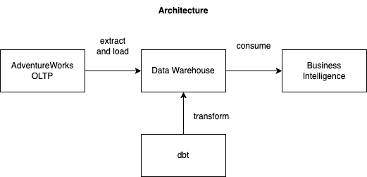
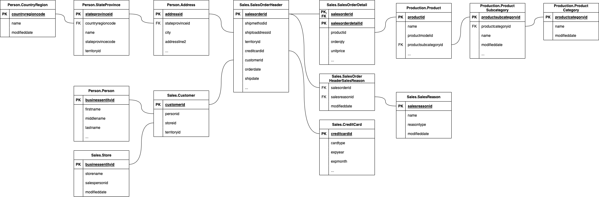
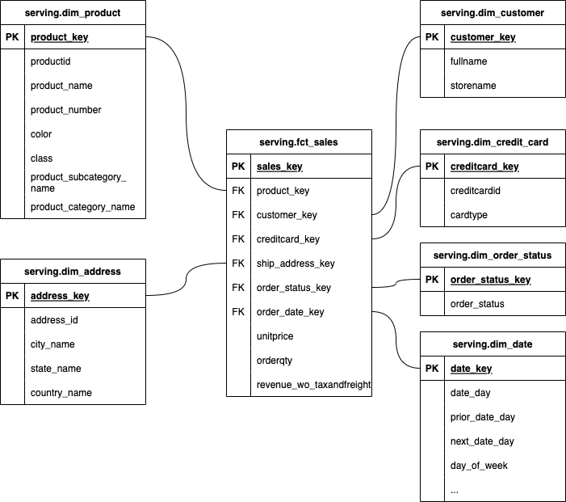
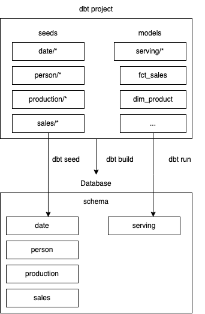

# dbt dimensional modelling

In this project, we extract data from a fictitious online store called AdventureWorks and load it to a data warehouse to support Business Intelligence (BI) use-cases. 

We mock the extraction and loading process using [dbt seeds](https://docs.getdbt.com/docs/build/seeds). The seed data produces the source schema in the data warehouse. 

We then create dbt models to perform model the data to be used for BI. 



## Source schema 

The source schema for Adventure Works OLTP is modelled using a 3rd normal form (3NF) modelling approach. 



## Target schema 

The target schema modelling using Kimball's dimensional modelling approach. 



## Getting started 

Install the database of your choice for the dbt project. The databases that the dbt project has been tested with are: 
- [DuckDB](https://duckdb.org/docs/installation/index)
- [PostgreSQL](https://www.postgresql.org/download/) 

After installing the database of your choice, you can install the dbt connector for the database engine of your choice: 

Install dbt connector for `duckdb`: 

```
pip install dbt-duckdb
```

Install dbt connector for `postgresql`: 

```
pip install dbt-postgres
```

After installing the dbt connector, you can configure [profiles.yml](adventureworks/profiles.yml) with the connection details to your database:

```
adventureworks:
  target: duckdb
  outputs:
    duckdb:
     type: duckdb
     path: tmp/adventureworks.duckdb
     threads: 12
```


Install dbt dependencies: 

```
dbt deps 
```


After that, you can deploy the dbt assets to the database by running the following command:

```
dbt build 
```

The `dbt build` command will perform the following: 
1. Run all dbt seeds (dbt seed)
2. Run all dbt models (dbt run)
3. Run all dbt tests (dbt test)



The project uses dbt seed files to mock data being ingested into a data warehouse. 


Run logs: 

```
06:24:09  1 of 58 START seed file person.address ......................................... [RUN]
06:24:09  2 of 58 START seed file person.countryregion ................................... [RUN]
06:24:09  3 of 58 START seed file sales.creditcard ....................................... [RUN]
06:24:09  4 of 58 START seed file sales.customer ......................................... [RUN]
06:24:10  2 of 58 OK loaded seed file person.countryregion ............................... [INSERT 238 in 1.36s]
06:24:10  5 of 58 START seed file date.date .............................................. [RUN]
06:24:15  5 of 58 OK loaded seed file date.date .......................................... [INSERT 731 in 4.79s]
06:24:15  6 of 58 START seed file person.person .......................................... [RUN]
06:24:18  1 of 58 OK loaded seed file person.address ..................................... [INSERT 1675 in 9.16s]

... 

06:25:11  56 of 58 PASS not_null_dim_credit_card_creditcard_key .......................... [PASS in 0.07s]
06:25:11  55 of 58 PASS not_null_dim_credit_card_cardtype ................................ [PASS in 0.08s]
06:25:11  57 of 58 PASS not_null_dim_credit_card_creditcardid ............................ [PASS in 0.08s]
06:25:11  58 of 58 PASS unique_dim_credit_card_creditcardid .............................. [PASS in 0.08s]
06:25:11  
06:25:11  Finished running 15 seeds, 7 table models, 36 tests in 0 hours 1 minutes and 2.84 seconds (62.84s).
06:25:11  
06:25:11  Completed successfully
```
