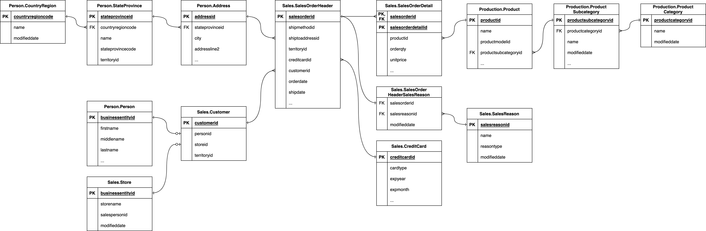

## Part 1: Setup dbt project and database

### Step 1: Before you get started

Before you can get started: 

- You must have either DuckDB or PostgreSQL installed. Choose one, and download and install the database using one of the following links:
    - Download [DuckDB](https://duckdb.org/docs/installation/index)
    - Download [PostgreSQL](https://www.postgresql.org/download/)
- You must have Python 3.8 or above installed
- You must have dbt version 1.3.0 or above installed
- You should have a basic understanding of [SQL](https://www.sqltutorial.org/)
- You should have a basic understanding of [dbt](https://docs.getdbt.com/docs/quickstarts/overview)

### Step 2: Clone the repository

Clone the [github repository](https://github.com/Data-Engineer-Camp/dbt-dimensional-modelling) by running this command in your terminal: 

```text
git clone https://github.com/Data-Engineer-Camp/dbt-dimensional-modelling.git
cd dbt-dimensional-modelling/adventureworks
```

### Step 3: Install dbt database adaptors

Depending on which database you’ve chosen, install the relevant database adaptor for your database: 

```text
# install adaptor for duckdb
pip install dbt-duckdb

# OR 

# install adaptor for postgresql
pip install dbt-postgres
```

### Step 4: Setup dbt profile

The dbt profile (see `adventureworks/profiles.yml`) has already been pre-configured for you. Verify that the configurations are set correctly based on your database credentials: 

```yaml
adventureworks:
  target: duckdb # leave this as duckdb (default), or change this to your chosen database

  # supported databases: duckdb, postgres 
  outputs:
    duckdb: 
     type: duckdb
     path: target/adventureworks.duckdb
     threads: 12

    postgres:  
      type: postgres
      host: localhost
      user: postgres
      password: postgres
      port: 5432
      dbname: adventureworks # create this empty database beforehand 
      schema: dbo
      threads: 12
```

### Step 5: Install dbt dependencies

We use packages like [dbt_utils](https://hub.getdbt.com/dbt-labs/dbt_utils/latest/) in this project, and we need to install the libraries for this package by running the command: 

```
dbt deps 
```

### Step 6: Seed your database

We are using [dbt seeds](https://docs.getdbt.com/docs/build/seeds) (see `adventureworks/seeds/*`) to insert AdventureWorks data into your database: 

```text
# seed duckdb 
dbt seed --target duckdb

# seed postgres
dbt seed --target postgres
```

### Step 7: Examine the database source schema

All data generated by the business is stored on an OLTP database. The Entity Relationship Diagram (ERD) of the database has been provided to you. 

Examine the database source schema below, paying close attention to: 

- Tables
- Keys
- Relationships



*Source schema*

### Step 8: Query the tables

Get a better sense of what the records look like by executing select statements using your database's SQL editor.

For example:  

```sql
select * from sales.salesorderheader limit 10; 
```

Output: 

```
┌──────────────┬──────────────┬─────────────────┬───┬───────────────┬─────────────────────┬────────────────┐
│ salesorderid │ shipmethodid │ billtoaddressid │ … │ salespersonid │      shipdate       │ accountnumber  │
│    int32     │    int32     │      int32      │   │     int32     │      timestamp      │    varchar     │
├──────────────┼──────────────┼─────────────────┼───┼───────────────┼─────────────────────┼────────────────┤
│        43659 │            5 │             985 │ … │           279 │ 2011-06-07 00:00:00 │ 10-4020-000676 │
│        43660 │            5 │             921 │ … │           279 │ 2011-06-07 00:00:00 │ 10-4020-000117 │
│        43661 │            5 │             517 │ … │           282 │ 2011-06-07 00:00:00 │ 10-4020-000442 │
│        43662 │            5 │             482 │ … │           282 │ 2011-06-07 00:00:00 │ 10-4020-000227 │
│        43663 │            5 │            1073 │ … │           276 │ 2011-06-07 00:00:00 │ 10-4020-000510 │
│        43664 │            5 │             876 │ … │           280 │ 2011-06-07 00:00:00 │ 10-4020-000397 │
│        43665 │            5 │             849 │ … │           283 │ 2011-06-07 00:00:00 │ 10-4020-000146 │
│        43666 │            5 │            1074 │ … │           276 │ 2011-06-07 00:00:00 │ 10-4020-000511 │
│        43667 │            5 │             629 │ … │           277 │ 2011-06-07 00:00:00 │ 10-4020-000646 │
│        43668 │            5 │             529 │ … │           282 │ 2011-06-07 00:00:00 │ 10-4020-000514 │
├──────────────┴──────────────┴─────────────────┴───┴───────────────┴─────────────────────┴────────────────┤
│ 10 rows                                                                             23 columns (6 shown) │
└──────────────────────────────────────────────────────────────────────────────────────────────────────────┘
```

When you’ve successfully set up the dbt project and database, we can now move into the next part to identify the tables required for a dimensional model. 

[&laquo; Previous](../README.md) [Next &raquo;](part02-identify-business-process.md)
