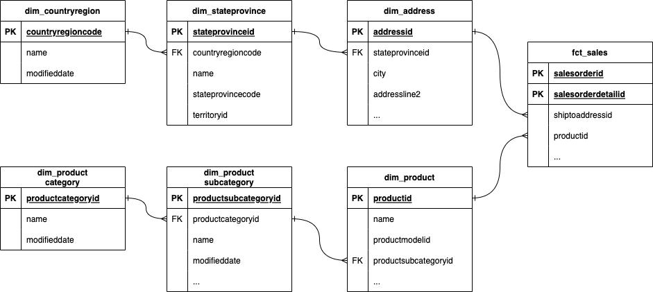
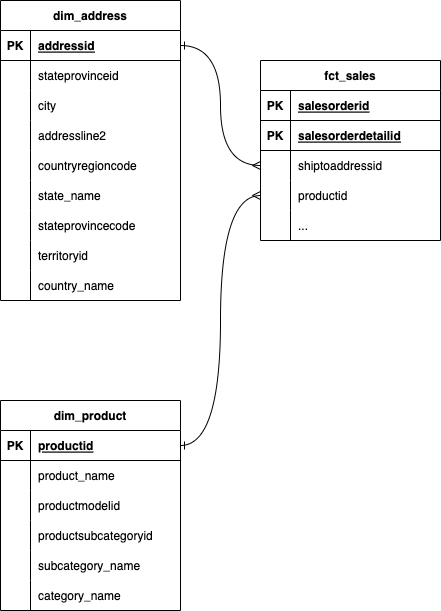

## Part 3: Identify the fact and dimension tables

Based on the information provided from the earlier part, we want to create a dimensional model that represents that business’ Sales process and also be able to slice and dice the data by: 

- Product category and subcategory
- Customer
- Order status
- Shipping country, state, and city
- Date (year, month, day)

### Fact tables

[Fact tables](https://www.kimballgroup.com/data-warehouse-business-intelligence-resources/kimball-techniques/dimensional-modeling-techniques/facts-for-measurement/) are database tables that represent a business process in the real world. Each record in the fact table represents a business event such as a: 

- Item sale
- Website click
- Production work order

There are two tables in the sales schema that catch our attention. These two tables can be used to create the fact table for the sales process: 

- The `sales.salesorderheader` table contains information about the credit card used in the order, the shipping address, and the customer. Each record in this table represents an order header that contains one or more order details.
- The `sales.salesorderdetail` table contains information about the product that was ordered, and the order quantity and unit price, which we can use to calculate the revenue. Each record in this table represents a single order detail.

*Sales Order Header and Detail*

Let’s define a fact table called `fct_sales` which joins `sales.salesorderheader` and `sales.salesorderdetail` together. Each record in the fact table (also known as the [grain](https://www.kimballgroup.com/data-warehouse-business-intelligence-resources/kimball-techniques/dimensional-modeling-techniques/grain/)) is an order detail.

*fct_sales table*

### Dimension tables

[Dimension tables](https://www.kimballgroup.com/data-warehouse-business-intelligence-resources/kimball-techniques/dimensional-modeling-techniques/dimensions-for-context/) are used to represent contextual or descriptive information for a business process event. Examples of dimensions include: 

- Customer details: Who is the customer for a particular order number? 
- Website click location details: Which button is the user clicking on? 
- Product details: What are the details of the product that was added to the cart? 

Based on the business questions that our business user would like answered, we can identify several tables that would contain useful contextual information for our business process: 

- `person.address`
- `person.countryregion`
- `production.product`
- `production.productcategory`
- `sales.customer`
- `sales.store`
- And many more …

There are different ways we could create the dimension tables. We could use the existing relationships between the tables as depicted in the diagram below. 

*Snowflake schema*

This is known as a snowflake schema design, where the fact table is the centre of the snowflake, and there are many fractals branching off the centre of the snowflake. However, this results in many joins that need to be performed by the consumer of the dimensional model. 

Instead, we can denormalize the dimension tables by performing joins. 

*Star schema*

This is known as a star schema and this approach reduces the amount of joins that need to be performed by the consumer of the dimensional model. 

Using the star schema approach, we can identify 6 dimensions as shown below that will help us answer the business questions:

- `dim_product` : a dimension table that joins `product`, `productsubcategory`, `productcategory`
- `dim_address` : a dimension table that joins `address`, `stateprovince`, `countryregion`
- `dim_customer` : a dimension table that joins `customer`, `person`, `store`
- `dim_credit_card` : a dimension table created from `creditcard`
- `dim_order_status` : a dimension table created by taking distinct statuses from `salesorderheader`
- `dim_date` : a specially generated dimension table containing date attributes using the [dbt_date](https://hub.getdbt.com/calogica/dbt_date/latest/) package. 

*Note: We have manually seeded the `dim_date` table since DuckDB is not supported by the dbt_date package.*

*Dimension tables*

In the next part, we use dbt to create the fact and dimension tables we have identified. 

[&laquo; Previous](part02-identify-business-process.md) [Next &raquo;](part04-create-dimension.md)
